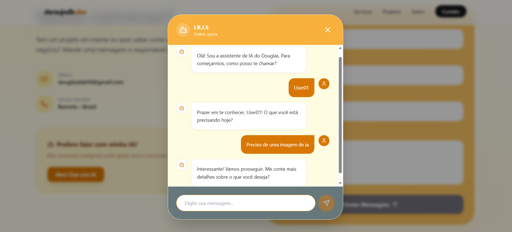
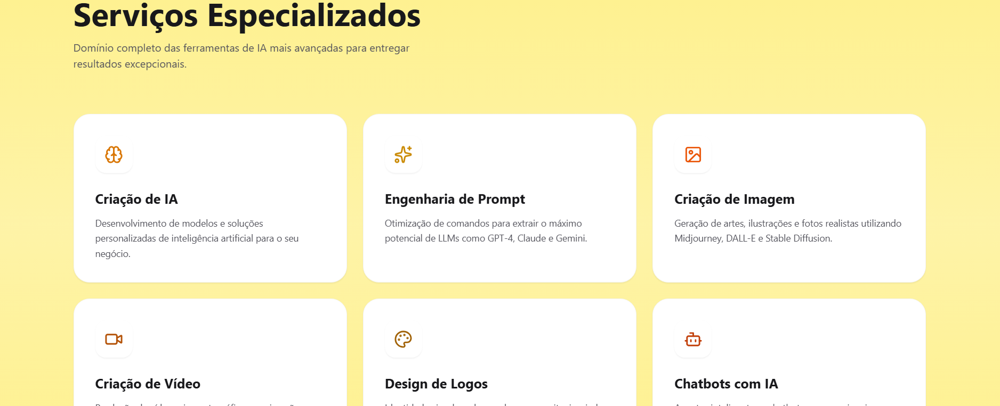

# daraujodb.dev - Portfólio de Especialista em IA

Este é o portfólio profissional de **Douglas Araujo**, um especialista em Inteligência Artificial focado em transformar o futuro através de soluções personalizadas de engenharia de prompt, automação e criação generativa.


## 🚀 Funcionalidades

- **Design Moderno & Responsivo**: Interface limpa e elegante desenvolvida com Tailwind CSS e Framer Motion.
- **Assistente IA Integrado**: Chat interativo alimentado pelo Google Gemini que ajuda potenciais clientes a estruturarem suas ideias.
- **Seções Detalhadas**:
  - **Serviços**: Consultoria em IA, Automação de Processos e Engenharia de Prompt.
  - **Projetos**: Vitrine de soluções implementadas.
  - **Sobre**: Trajetória e expertise técnica.
  - **Contato**: Formulário e chat direto com IA.

## 🛠️ Tecnologias Utilizadas

- **Frontend**: React 18, TypeScript, Vite.
- **Estilização**: Tailwind CSS.
- **Animações**: Framer Motion (motion/react).
- **Ícones**: Lucide React.
- **IA**: Google Generative AI SDK (Gemini 3 Flash).

## 📸 Screenshots

### 1. Hero & Navegação

*Interface principal com foco em conversão e clareza visual.*

### 2. Assistente IA (Chat)

*Fluxo inteligente de coleta de leads e geração de ideias em tempo real.*

### 3. Serviços & Expertise

*Apresentação clara das soluções oferecidas.*

## ⚙️ Configuração Local

1. **Clonar o repositório**:
   ```bash
   git clone https://github.com/dgarauj04/LandingPage-IA
   ```

2. **Instalar dependências**:
   ```bash
   npm install
   ```

3. **Configurar Variáveis de Ambiente**:
   Crie um arquivo `.env` na raiz e adicione sua chave da API do Gemini:
   ```env
   GEMINI_API_KEY=sua_chave_aqui
   ```

4. **Executar em modo de desenvolvimento**:
   ```bash
   npm run dev
   ```

---
